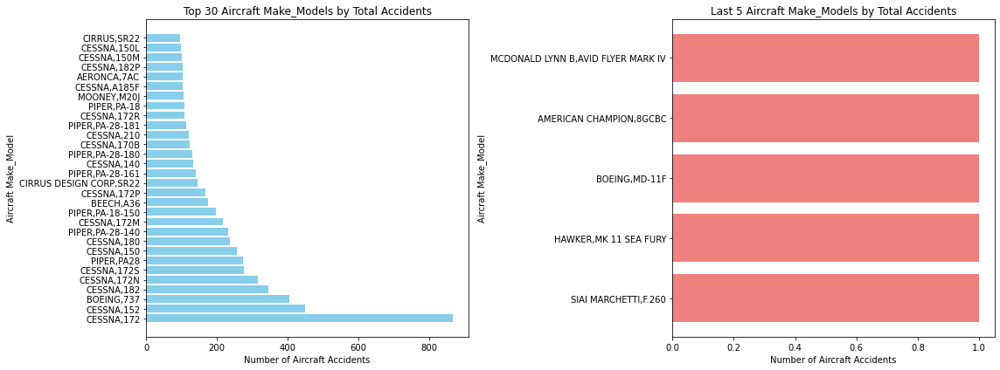
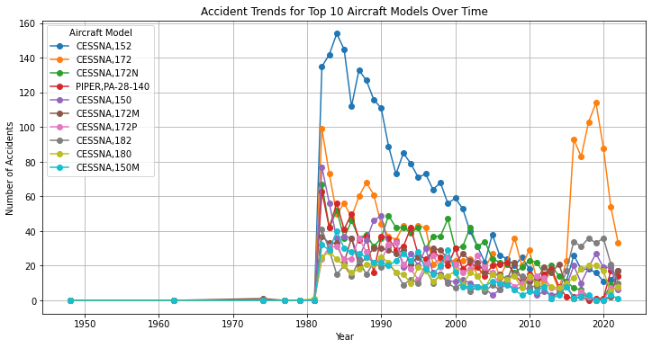
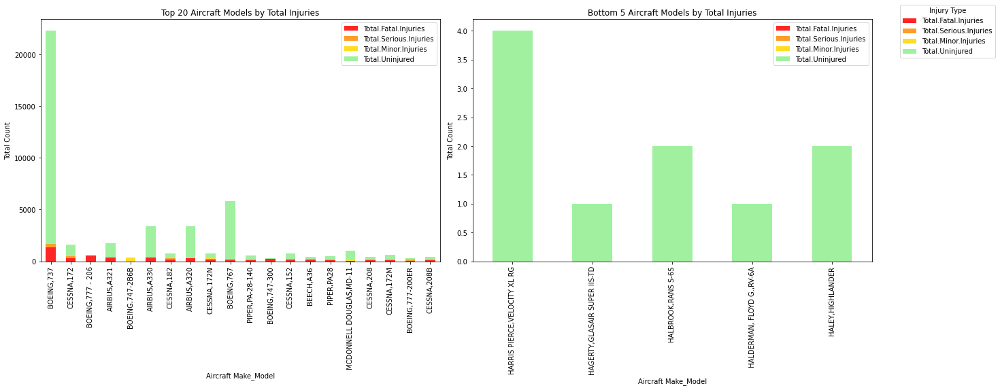

# Aviation Risk Analysis
## Overview
This project analyzes aviation accident data from **1962 to 2023**, focusing on civil aviation accidents recorded by the **National Transportation Safety Board(NTSB)**. Through **descriptive analysis**, the study highlights accident occurences across different aircraft models and flight phases. The insights derived from this analysis will help identify **low-risk aircraft** best suited for business expansion, ensuring **safety, operational reliability and cost efficiency**.

## Business Problem
The company is expanding into the **aviation industry** to diversify its portfolio by purchasing and operating aircraft for **commercial and private enterprises**. However, it lacks sufficient knowledge about the potential risks associated with different aircraft styles.

This analysis aims to answer the critical question:

**Which aircraft models pose the lowest risk and are best suited for business operations?**

By evaluating historical data, we help the company make informed decisions about **safety assurance, operational efficiency, and cost and reputation management** in the aviation sector.

## Data
The dataset for this analysis is sourced from **NTSB** and contains aviation accidents records from **1962 t0 2023**. Each accident record includes:
- Aircraft Make & Model
- Flight Phase (e.g., Takeoff, Kanding, Cruise)
- Weather Conditions
- Event Date & Location
- Severity of the Accident

This data allows us to analyze **accident occurences, trends by aircraft type and flight phase risks** to provide actionable business insights.

## Methods
This project employs **descriptive analysis** to determine which aircraft models have **the lowest risk**. The key aspects analyzed include:

**a.) Accident Distribution by Make & Model**

*Question: How are accidents distributed across different aircraft models? (Which models have the lowest accident rates?)*

1. Filter the dataset to focus on airplanes.

2. Calculate the number of accidents recorded for each aircraft Make & Model.

3. Identify aircraft models with the lowest accident rates, providing insights into the safest investment options.

**b.) Aircraft Reliability Over Time**

*Question: How reliable are different aircraft models over time? (Are certain aircraft models consistently involved in accidents?)*

1. Trend Analysis: Calculate the number of accidents per aircraft model for each year to identify recurring patterns.

2. Identifying High-Risk vs. Low-Risk Models: Highlight models that frequently appear in accident records and those that show improved safety over time.

**c.) Accident Severity by Model**

*Question: How severe are accidents across different aircraft models? (Which models have the least severe accidents?)*

1. Categorizing Accident Severity: Use the "Injury Severity" column to classify accidents as Fatal, Serious, Minor, or None.

2. Identifying High and Low Severity Models: 

- Determine aircraft models with the highest proportion of fatal accidents (most severe).

- Identify aircraft models with the lowest proportion of fatal accidents (least severe).

- Compare models based on total numbers of fatal, serious, minor, and uninjured incidents.

## Results
**1. Accident Distribution by Make_Model**

The analysis of accident distribution across different aircraft models revealed significant variation in accident frequency. The left chart illustrates that a small number of aircraft models account for the majority of recorded accidents, following a classic long-tail distribution. Most models had very few accidents, while a few models had disproportionately high numbers.

Specifically:

- The majority of models recorded fewer than 5 accidents.

- The top 5 models were responsible for a large share of total accidents.

On the right chart, a focused view of the top accident-prone models shows that these models consistently recorded the highest number of accidents, highlighting where most incidents are concentrated.

*Insight:*
While the dataset does not directly present accident rates (accidents relative to the total number of aircraft in operation for each model), the raw count suggests that many models with fewer recorded accidents could be potential candidates for safer investment. However, a proper accident rate would require additional data on exposure (e.g., total flights, flight hours, or fleet size per model) for a more definitive conclusion.

**2. Aircraft Reliability Over Time**

The analysis of accident trends over time reveals notable patterns regarding the reliability of various aircraft models.

From the trend plot, it is evident that:

Certain models, such as CESSNA_152 and CESSNA_172, have consistently appeared in accident records across multiple years, suggesting their prevalence in the accident dataset and their widespread use.

CESSNA_152 shows a pronounced peak in accident frequency during earlier years, followed by a steady decline, indicating either improved safety measures, reduced usage, or fleet retirement over time.

Other models like PIPER_PA-28-140, CESSNA_172N, and CESSNA_182 show relatively steady accident trends without significant spikes or declines.

A group of less common models exhibit isolated spikes, which may result from limited data or rare but concentrated accident events.

*Insights:*
*High-Risk Patterns: Models like CESSNA_152 and CESSNA_172 could be flagged for further investigation due to their persistent appearance in accident data, but this could also be attributed to their high market presence.*

*Stabilizing or Improving Trends: The declining trend for CESSNA_152 suggests potential reliability improvements or reduced operational exposure.*

*Low-Risk Patterns: Some models show very few or isolated accident occurrences, suggesting potentially lower risk or limited operational history.*

*As with the previous analysis, a full reliability assessment would benefit from incorporating aircraft utilization data (flight hours, active fleet size) to normalize accident counts over time.*

**3. Accident Severity by Aircraft Model**
The analysis of accident severity across different aircraft models highlights key patterns in injury outcomes.

*Figure: Distribution of accident severity across different aircraft models*

From the bar charts, it is evident that:

Certain models have a high frequency of uninjured cases, as shown by the dominant green bars, suggesting they provide better safety outcomes in accidents.

Fatal and serious injuries appear in lower proportions compared to minor injuries and uninjured cases for most models, but some models still show notable red and orange bars, indicating higher accident severity.

A few aircraft models have a significant number of fatal and serious injuries, which may be linked to specific operational risks or aircraft characteristics.

Models with isolated spikes in accident severity could be due to rare but severe incidents or limited dataset representation.

*Insights:*
*High-Risk Patterns:Some aircraft models exhibit a notable number of fatal and serious injuries, requiring further investigation into operational safety and risk factors.*

*Stable or Low-Risk Models:Models with predominantly minor or uninjured cases indicate better survivability and potentially safer designs or operational contexts*

*Data Limitations & Further Analysis:A complete assessment should incorporate aircraft utilization data (flight hours, fleet size) to normalize accident severity findings.*

# For more information
See the full analysis [View Jupyter Notebook](https://github.com/vanzerrriii/Aviation_Risk_Analysis/blob/main/Aviation_Risk_Analysis.ipynb)  or review the [Presentation](https://github.com/vanzerrriii/Aviation_Risk_Analysis/blob/main/Presentation.pdf)

# Dashboard
View the interactive for detailed insights